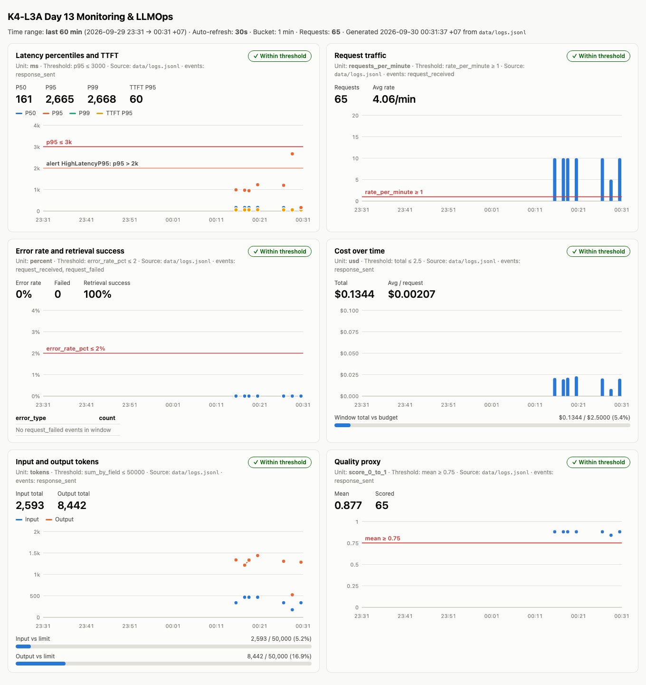

# Báo cáo cá nhân — K4-L3A Day 13 Monitoring & LLMOps

> Mỗi học viên hoàn thiện một file duy nhất này. Khi dẫn evidence, dùng đường dẫn tương đối, ví dụ `evidence/07-trace-waterfall.png`.

## 1. Thông tin học viên

- **Họ và tên:** Nguy Khac Phi Long
- **MSSV:** 2A202602532
- **Lớp:** K4-L3A
- **Repository URL:** https://github.com/NKPhiLong/K4-L3-DAY13-NguyKhacPhiLong-2A202602532-Monitoring-LLMOps
- **Commit SHA cuối:** _(điền SHA của commit cuối cùng sau khi push — xem mục 9)_
- **Challenge ID:** `day13-k4-l3a-monitoring-llmops-v1`
- **Tên project Langfuse cá nhân:** `day13-k4-l3a-2A202602532`

## 2. Evidence index

| Evidence | Đường dẫn |
|---|---|
| Pytest cuối | [`evidence/01-pytest.png`](evidence/01-pytest.png) · [`.txt`](evidence/01-pytest.txt) |
| Log validator | [`evidence/02-log-validator.png`](evidence/02-log-validator.png) · [`.txt`](evidence/02-log-validator.txt) |
| Dashboard validator | [`evidence/03-dashboard-validator.png`](evidence/03-dashboard-validator.png) · [`.txt`](evidence/03-dashboard-validator.txt) |
| Structured log | [`evidence/04-structured-log.png`](evidence/04-structured-log.png) · [`.txt`](evidence/04-structured-log.txt) |
| PII redaction | [`evidence/05-pii-redaction.png`](evidence/05-pii-redaction.png) · [`.txt`](evidence/05-pii-redaction.txt) |
| Trace list | [`evidence/06-trace-list.png`](evidence/06-trace-list.png) · đối chiếu API: [`06-trace-list-api.txt`](evidence/06-trace-list-api.txt) |
| Trace waterfall | [`evidence/07-trace-waterfall.png`](evidence/07-trace-waterfall.png) |
| Trace metadata | [`evidence/08-trace-metadata.png`](evidence/08-trace-metadata.png) |
| Prompt versions | [`evidence/09-prompt-versions.png`](evidence/09-prompt-versions.png) |
| Prompt rollback | [`evidence/10a-production-v2.png`](evidence/10a-production-v2.png) → [`evidence/10b-rollback-v1.png`](evidence/10b-rollback-v1.png) |
| Dashboard runtime | [`evidence/11-dashboard-overview.png`](evidence/11-dashboard-overview.png) |
| Incident metric | [`evidence/12-incident-metric.png`](evidence/12-incident-metric.png) |
| Incident log | [`evidence/13-incident-log.png`](evidence/13-incident-log.png) · [`.txt`](evidence/13-incident-log.txt) |
| Incident trace | [`evidence/14-incident-trace.png`](evidence/14-incident-trace.png) · đối chiếu API: [`14-incident-trace-api.txt`](evidence/14-incident-trace-api.txt) |
| Baseline CP0 | [`evidence/baseline/`](evidence/baseline/) |

## 3. Kết quả kỹ thuật

| Nội dung | Baseline | Kết quả cuối | Nhận xét |
|---|---|---|---|
| `validate_logs.py` | 30/100 (20 dòng thiếu field bắt buộc, 20 dòng thiếu enrichment, 0 correlation ID) | **100/100** (156 dòng, 77 correlation ID, 0 thiếu field) | Correlation ID + enrichment + PII scrubber đều pass |
| `validate_dashboard.py` | HỢP LỆ 6/6 (contract có sẵn) | **HỢP LỆ 6/6** | Contract giữ nguyên; dashboard runtime dựng từ `data/logs.jsonl` |
| `pytest` | 22 passed | **46 passed** | +24 test: middleware, context leak, PII, scrubber order, trace children, dashboard, alert/SLO, audit, không serialize request |
| Số traces hợp lệ | 0 (chưa có key) | **73** trong project cá nhân | Mỗi trace có root `lab-agent-run` + `retrieval` + `llm-generation` |
| Số PII leak | 0 (starter đã scrub preview) | **0** (validator + `scan_secrets_pii.py` + `grep` 5 giá trị PII giả = 0 dòng) | Scrub mọi field, không chỉ payload |
| Latency P95 / TTFT P95 | 162 ms / 55 ms | Bình thường ~165 ms / 55 ms; khi incident P95 **2665 ms** | Cửa sổ 60' chứa cả incident nên P95 toàn cửa sổ = 2665 ms (5/65 request chậm > 5%) |
| Retrieval success rate | 100% | **100%** | `rag_slow` làm retrieval chậm chứ không lỗi, nên error rate vẫn 0% |

## 4. Logging và PII

- **Cách tạo/nhận và truyền correlation ID:** [`app/middleware.py`](../app/middleware.py) gọi `clear_contextvars()` đầu mỗi request, rồi nhận header `x-request-id` nếu nó khớp regex an toàn `^[A-Za-z0-9][A-Za-z0-9._:-]{0,63}$`, ngược lại sinh `req-<8 hex>` từ `uuid4`. ID được `bind_contextvars(correlation_id=...)`, gán vào `request.state`, truyền vào `agent.run` (đưa vào trace metadata) và trả lại qua header `x-request-id` cùng `x-response-time-ms`.
- **Các metadata được ghi vào structured log:** `ts`, `level`, `service`, `event`, `correlation_id`, `env`, `user_id_hash` (sha256 12 ký tự, không lưu user_id thô), `session_id`, `feature`, `model` — bind một lần trong [`app/main.py`](../app/main.py) *trước* `request_received`, nên `response_sent`/`request_failed` dùng chung context. `response_sent` có thêm `latency_ms`, `ttft_ms`, `tokens_in`, `tokens_out`, `cost_usd`, `quality_score`, `tool_name`, `tool_success`.
- **Cách bảo đảm PII được scrub trước khi ghi:** processor `scrub_event` trong [`app/logging_config.py`](../app/logging_config.py) scrub đệ quy *mọi* giá trị chuỗi (kể cả payload lồng nhau và traceback). Nó được đặt sau `format_exc_info` (để traceback đã là chuỗi) và **trước** `JsonlFileProcessor`/`JSONRenderer`, nên dữ liệu chưa scrub không bao giờ được serialize hay ghi file. Pattern trong [`app/pii.py`](../app/pii.py): email, thẻ thanh toán, CCCD 12 số, điện thoại VN (`0`/`+84`, có dấu cách/chấm/gạch), hộ chiếu VN; thẻ chạy trước CCCD/điện thoại để số thẻ bị che trọn. Trace cũng chỉ nhận bản tóm tắt đã scrub (`summarize_text`), không nhận raw prompt/output.
- **Cách kiểm chứng kết quả:** test [`tests/test_logging_pii_processor.py`](../tests/test_logging_pii_processor.py) kiểm tra thứ tự processor và file JSONL không chứa PII; [`tests/test_correlation_middleware.py`](../tests/test_correlation_middleware.py) gửi request thật có số thẻ/điện thoại. Runtime: gửi 2 request chứa email/điện thoại/CCCD/thẻ/hộ chiếu **giả**, log ghi `[REDACTED_*]`, `grep` 5 giá trị gốc trong `data/logs.jsonl` = 0 dòng và `scan_secrets_pii.py` báo sạch ([evidence 05](evidence/05-pii-redaction.png)).

## 5. Tracing và prompt versioning

- **Cách xác nhận traces do chính tôi tạo trong project cá nhân:** tôi tự tạo project `day13-k4-l3a-2A202602532` và key riêng (chỉ nằm trong `.env`, đã gitignore). Mọi trace sinh từ `python scripts/load_test.py` do tôi chạy; [`06-trace-list-api.txt`](evidence/06-trace-list-api.txt) liệt kê 73 trace kèm `correlation_id` khớp với `data/logs.jsonl`.
- **Cấu trúc root/retrieval/generation observations:** [`app/agent.py`](../app/agent.py) dùng Langfuse SDK v4: root `lab-agent-run` (`as_type="agent"`, `@observe`) có 2 con — `retrieval` (`as_type="retriever"`: query preview đã scrub, `doc_count`, `retrieval_ms`) và `llm-generation` (`as_type="generation"`: `model`, liên kết `prompt` được quản lý, `usage_details` input/output/total, `cost_details` input/output/total, `completion_start_time` = thời điểm gọi + TTFT). Không bật `capture_input/output` để tránh gửi raw text.
- **Cách nối trace với log:** `correlation_id` được đưa vào trace metadata qua `propagate_attributes(metadata={"correlation_id": ...})` nên có ở mọi observation. Ví dụ log [`04`](evidence/04-structured-log.txt) `req-067702c0` ↔ trace `e31952f5996af778451ca2bff186a92a`.
- **Prompt name:** `day13-chat` (một prompt, 2 version, đủ 3 biến `{{feature}}`, `{{docs}}`, `{{message}}`).
- **Version/label baseline:** v1 — label `baseline` (ban đầu cũng là `production`).
- **Version/label candidate:** v2 ("Answer in no more than three concise bullet points.") — label `candidate`.
- **Trace ID của mỗi version:**

  | Bước | `.env` label | Trace ID | correlation_id | Version ghi trên trace |
  |---|---|---|---|---|
  | Baseline | `baseline` | `28d2e1a091cc2b2b6c03d922bfa916d1` | `req-385edbdf` | v1 |
  | Candidate | `candidate` | `8b974eb555d564c68274977219b27309` | `req-2354f698` | v2 |
  | Promote | `production` (→ v2) | `0f052ccba297423574f37084efbbf2cb` | `req-3f5aaca8` | v2 |
  | Rollback | `production` (→ v1) | `e31952f5996af778451ca2bff186a92a` | `req-067702c0` | v1 |

  Mọi trace trên có `prompt_source=langfuse` (không phải `local-v1`) và generation được link tới prompt `day13-chat` đúng version.
- **Cách promote và rollback `production`:** không sửa code. Promote: chuyển label `production` sang v2 (`update_prompt(name="day13-chat", version=2, new_labels=["candidate","production"])`), đặt `LANGFUSE_PROMPT_LABEL=production`, restart API (xóa cache prompt 60 s), chạy workload → trace ghi v2 ([`10a`](evidence/10a-production-v2.png)). Rollback: chuyển `production` về v1 (`version=1, new_labels=["baseline","production"]`), restart, chạy lại → trace ghi v1 ([`10b`](evidence/10b-rollback-v1.png)).

## 6. Dashboard, SLO và alerts

- **Dashboard và sáu panel:** [`scripts/build_dashboard.py`](../scripts/build_dashboard.py) đọc contract [`config/dashboard.yaml`](../config/dashboard.yaml) và `data/logs.jsonl`, dựng HTML (`data/dashboard.html`, time range 60 phút, bucket 1 phút, auto-refresh 30 s, có `--watch`). Sáu panel đúng contract: (1) Latency P50/P95/P99 + TTFT P95, SLO line p95 ≤ 3000 ms và đường alert 2000 ms; (2) Traffic request/phút, threshold ≥ 1; (3) Error rate %, bảng breakdown `error_type`, retrieval success %; (4) Cost USD theo phút + meter tổng/ngân sách 2.5 USD; (5) Token input/output + meter so với 50 000; (6) Quality mean, threshold ≥ 0.75. Mỗi panel ghi đơn vị, nguồn, threshold và trạng thái (✓/✕ kèm chữ).
- **SLO và lý do chọn:** [`config/slo.yaml`](../config/slo.yaml) — `fast_successful_requests`: tỷ lệ request `response_sent` với `latency_ms ≤ 3000` trên tổng `request_received`, mục tiêu **99.5% / 28 ngày**. Giữ 3000 ms trùng contract dashboard để SLO, dashboard và alert dùng một con số; baseline P99 ≈ 160 ms nên ngưỡng chừa chỗ cho LLM thật. Chọn 99.5% (không phải 99.9%) vì service phụ thuộc vector store và LLM bên ngoài không có SLA.
- **Cách tính error budget:** budget = 0.5% tổng request 28 ngày. Ví dụ 10 req/phút → 403 200 request → cho phép **2 016 request xấu** (≈ 201.6 phút sập hoàn toàn). Burn rate = tỷ lệ xấu quan sát / 0.005; fast burn > 14.4 trong 1 h (tiêu 2% budget/giờ) → P1, slow burn > 6 trong 6 h → P2. Chính sách: budget > 50% release bình thường; 0–50% chỉ fix/rollback có canary; cạn budget thì đóng băng thay đổi prompt/model.
- **Ba alert và runbook tương ứng:** [`config/alert_rules.yaml`](../config/alert_rules.yaml) + [`docs/alerts.md`](../docs/alerts.md), đều symptom-based, kênh Slack `#k4-l3a-day13-alerts`, owner là tôi:
  1. `HighLatencyP95` (P2, duration 5m): P95 5 phút > 2000 ms với ≥ 10 response — cảnh báo sớm trước khi chạm SLO 3000 ms. Challenge này làm alert này kích hoạt (P95 2665 ms).
  2. `HighErrorRate` (P1, 5m): lỗi > 2% với ≥ 20 request trong 5 phút.
  3. `CostBudgetBurn` (P2, 15m): chi 1 giờ > 0.21 USD (gấp 2 nhịp 2.5 USD/ngày) hoặc cost/request > 0.004 USD (≈ 2× baseline 0.0019).

## 7. Điều tra challenge

- **Challenge ID:** `day13-k4-l3a-monitoring-llmops-v1` (cohort K4, seed 1311, `affected_feature=monitoring`, `latency_threshold_ms=2000`; file do Lab Coach gửi, lưu ở `config/challenge.json`, không commit).
- **Khoảng thời gian điều tra:** 2026-09-29 17:28:42Z → 17:29:12Z (00:28:42 → 00:29:12 giờ VN ngày 30/09): từ `incident_enabled` tới `incident_disabled`.
- **Triệu chứng từ metrics:** panel Latency ([evidence 12](evidence/12-incident-metric.png)): bucket 00:28 có P95 = **2665 ms**, vượt đường alert `HighLatencyP95` 2000 ms và ngưỡng challenge 2000 ms (baseline 162 ms, gấp ~16 lần). TTFT P95 vẫn ~55 ms; error rate 0%, retrieval success 100%, cost/token không đổi → không phải lỗi, không phải LLM, nghi ngờ bước trước generation. `/metrics` lúc đó: `latency_p95=2668`, `ttft_p95=55`, `error_breakdown={}`.
- **Log line và correlation ID liên quan:** `python scripts/find_slow_requests.py --threshold-ms 2000 --since 2026-09-29T17:28:00Z --until 2026-09-29T17:30:00Z` ([evidence 13](evidence/13-incident-log.png)) trả đúng 5 request, cả 5 đều `feature=monitoring`, `latency_ms≈2665`, `ttft_ms 51–55`, `tool_success=true`, nằm giữa `incident_enabled`/`incident_disabled`. Chọn `req-62d50770`:
  `{"event": "response_sent", "correlation_id": "req-62d50770", "feature": "monitoring", "latency_ms": 2665, "ttft_ms": 53, "tool_name": "retrieval", "tool_success": true, "ts": "2026-09-29T17:28:44.874501Z", ...}`
- **Trace ID và span gây ảnh hưởng:** trace `b0e8dc5ad688abe6cf6af064ecb244ab` (metadata `correlation_id=req-62d50770`, prompt `day13-chat`/production/v1) ([evidence 14](evidence/14-incident-trace.png), [đối chiếu API](evidence/14-incident-trace-api.txt)): root `lab-agent-run` 2666 ms = span **`retrieval` 2507 ms (94%)** + `llm-generation` 158 ms (TTFT 53 ms, 36/131 token, 0.002073 USD). Span `retrieval` là span gây chậm.
- **Root cause:** bước retrieval (vector store) chậm ~2.5 s mỗi lần gọi (incident `rag_slow`), trong khi LLM bình thường. Cả ba lớp cùng chỉ về một nguyên nhân: metric P95 tăng nhưng TTFT/lỗi/cost không đổi → log: đúng 5 request chậm, tool vẫn success → trace: 94% thời gian nằm ở span `retrieval`.
  **Yếu tố khuếch đại phát hiện thêm:** log cho thấy 5 request được xử lý *nối tiếp* — `request_received` của request sau đúng bằng thời điểm `response_sent` của request trước (17:28:42.2 → 44.9 → 47.5 → 50.2 → 52.9). Nguyên nhân: handler `async def chat` gọi trực tiếp `agent.run` đồng bộ nên chặn event loop. Server chỉ tốn 2.67 s/request nhưng người dùng chờ tới **8–13.4 s** (load test concurrency 5).
- **Fix action:** (1) khôi phục dependency retrieval (tắt incident: `inject_incident.py --disable`; thực tế là failover/scale vector store) — sau khi tắt, latency về ~165 ms; (2) commit `fix(cp3)`: chạy `agent.run` trong threadpool (`run_in_threadpool`) và khóa ghi metrics. Kiểm chứng bằng practice `rag_slow` với cùng 5 query challenge, concurrency 5: cả 5 request được nhận cùng lúc (17:33:29.334–.338), client latency **~3.6 s** thay vì 8–13.4 s; trace vẫn đủ cây cha-con và `correlation_id`. Test hồi quy `test_slow_dependency_does_not_serialize_concurrent_requests` fail trên code cũ, pass trên code mới.
- **Preventive measure:** (1) alert `HighLatencyP95` (P95 > 2000 ms trong 5 phút) để phát hiện trước khi vi phạm SLO 3000 ms; (2) đặt timeout cho retrieval (ví dụ 800 ms) và trả tài liệu fallback thay vì chờ, kèm metric riêng cho `retrieval_ms`; (3) giữ quy tắc không gọi code blocking trong handler async (đã có test hồi quy); (4) trong runbook, so TTFT với P95 để tách nhanh chậm retrieval và chậm LLM.

## 8. Giải thích và tự đánh giá

- **Một quyết định kỹ thuật quan trọng và lý do:** scrub PII bằng processor đệ quy trên *mọi* field và đặt nó sau `format_exc_info` nhưng trước file writer, thay vì chỉ scrub `payload`/`event` như gợi ý của starter. Lý do: chỉ scrub vài key sẽ rò khi sau này có field mới (ví dụ `detail` của exception hoặc traceback); đặt trước writer đảm bảo không có bản chưa scrub nào được serialize. Tương tự, tôi chỉ nhận `x-request-id` từ client khi khớp regex an toàn để header không chèn được dữ liệu tùy ý vào log.
- **Một lỗi/blocker đã gặp:** (1) Lần promote đầu, trace vẫn ghi `candidate v2` dù `.env` đã là `production`. (2) Langfuse trả HTTP 410 cho `GET /api/public/traces`. (3) Port 8000 đã bị một ứng dụng khác chiếm.
- **Cách tìm nguyên nhân và xử lý:** (1) So trace metadata với `.env` thấy label sai; nguyên nhân là shell đã `export` biến từ `.env` cũ trước khi restart, và `--env-file` của uvicorn (python-dotenv) không ghi đè biến đã có. Xử lý: khởi động API qua `env -u LANGFUSE_*` rồi chạy lại promote — trace đúng `production v2`. 10 trace chạy nhầm vẫn giữ nguyên, không xóa. (2) Đọc body lỗi: org tạo sau 16/09/2026 phải dùng `GET /api/public/v2/observations`; tôi chuyển sang API v2 để đối chiếu trace. (3) Không tắt ứng dụng khác; thêm biến `LAB_BASE_URL` cho `load_test.py`/`inject_incident.py` (mặc định vẫn `:8000`) và chạy lab ở port 8013.
- **Cách hiểu luồng Metrics → Logs → Traces:** metrics trả lời *có vấn đề gì và khi nào* (P95 tăng ở phút 00:28, TTFT không đổi); logs trả lời *request nào* (lọc theo thời gian và ngưỡng → 5 `correlation_id`); traces trả lời *bước nào* (span `retrieval` 94%). Mỗi lớp thu hẹp phạm vi cho lớp sau, và kết luận chỉ hợp lệ khi cả ba cùng chỉ về một nguyên nhân. Chính log (thời điểm `request_received`) còn lộ ra vấn đề thứ hai mà trace đơn lẻ không thấy: request bị xếp hàng.
- **Vai trò của prompt version, token/cost, SLO hoặc rollback trong vận hành LLM:** prompt version + label cho phép đổi hành vi model mà không deploy code, và mỗi trace ghi đúng version nên có thể so sánh latency/cost/quality giữa v1 và v2; rollback chỉ là chuyển label `production` và restart (không cần build). Token/cost trên generation cho biết chi phí theo từng request và phát hiện prompt làm output dài hơn (alert `CostBudgetBurn`). SLO + error budget biến "chậm bao nhiêu thì đáng lo" thành con số, quyết định lúc nào được release và lúc nào phải ưu tiên reliability.
- **Điều quan trọng nhất đã học:** average/tổng hợp có thể che vấn đề — P50 toàn cửa sổ vẫn 161 ms trong khi P95 là 2665 ms; và một dependency chậm có thể bị khuếch đại thành sự cố lớn hơn nhiều nếu code blocking chạy trên event loop.
- **Hạn chế hoặc phần chưa hoàn thành, nếu có:** dashboard là HTML tĩnh sinh từ log (auto-refresh 30 s bằng `--watch`), không phải hệ thống như Grafana. Quality score vẫn là heuristic của starter; câu trả lời của FakeLLM giống nhau cho mọi prompt nên v1/v2 chỉ khác token input. Request đầu tiên sau mỗi lần restart chậm ~1 s do fetch prompt (cold cache) — thấy ở P99 các phút bình thường. Tôi dùng AI coding assistant (Claude Code) hỗ trợ viết code/test và soạn báo cáo theo quy định cho phép; tôi đã kiểm tra và giải thích được các thay đổi.

**Bonus đã làm (khi phần bắt buộc chạy end-to-end):**

- Automation: [`scripts/scan_secrets_pii.py`](../scripts/scan_secrets_pii.py) (secret, PII thô, file cấm), [`scripts/build_dashboard.py`](../scripts/build_dashboard.py) (sinh dashboard + ảnh), [`.github/workflows/ci.yml`](../.github/workflows/ci.yml) (scan → pytest → dashboard contract → smoke end-to-end: chạy API, load test, bắt buộc `validate_logs` 100/100, scan log).
- Audit log: [`app/audit.py`](../app/audit.py) ghi thao tác bật/tắt incident vào `data/audit.jsonl` theo schema [`config/audit_schema.json`](../config/audit_schema.json) (actor đã scrub, IP chỉ lưu hash, trạng thái trước/sau, correlation_id), retention 90 ngày (prune khi khởi động), truy vấn: `python scripts/query_audit.py --action incident.enable --since-minutes 60`.

## 9. Checklist trước khi nộp

- [ ] Kết quả và evidence thuộc commit SHA cuối.
- [ ] Tất cả ảnh/output mở được bằng đường dẫn tương đối (còn chờ 06, 07, 08, 10b, 14 chụp từ Langfuse).
- [x] Incident evidence nối đúng metric → log → trace.
- [ ] Trace/prompt evidence thuộc project Langfuse cá nhân và ảnh không lộ key/secret.
- [x] Repository chạy lại được theo README.
- [x] Không có secret, API key, PII thô hoặc evidence của người khác/lớp khác.
- [ ] URL repo và commit SHA cuối đã được nộp trên LMS/Codelabs.
